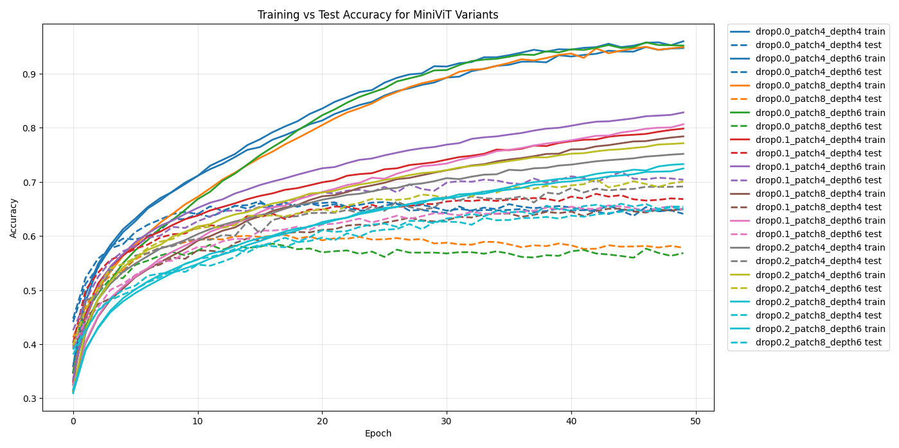

# MicroViT

A simple from-scratch implementation of a Vision Transformer (ViT) in PyTorch, inspired by the "mini" philosophy of `microGPT`.

## Main Objective
The goal is to demonstrate how a Transformer can "see" by processing image patches as tokens. This repo allows you to experiment with how changing the model's structure (like depth or patch size) affects its ability to learn.

## Project Files

* **`microViT.py`**: The core library. It contains the `MiniViT` model architecture and the essential training/evaluation functions.
* **`microViTtests.py`**: The experiment script. It imports the model from the core file and runs a battery of tests using different parameters (Dropout, Patch Size, and Depth) to find the best configuration.

## How to Run

1.  **Install dependencies**:
    `pip install torch torchvision matplotlib numpy`

2.  **Run the experiments**:
    ```bash
    python microViTtests.py
    ```
    This will download the CIFAR-10 dataset, train several model variations, and save the accuracy results.

## Results
The script compares training vs. testing accuracy across all variants to help visualize overfitting and the impact of architectural choices on small datasets.

